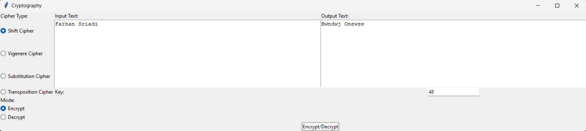

# Teknologi-Keamanan-dan-Privasi-Data

### Tugas 1
Kode Python menggunakan modul Tkinter untuk membuat GUI dengan fitur 
- Shift Cipher
- Vigenere Cipher
- Substitution Cipher
- Transposition Cipher

## Screenshot Aplikasi

